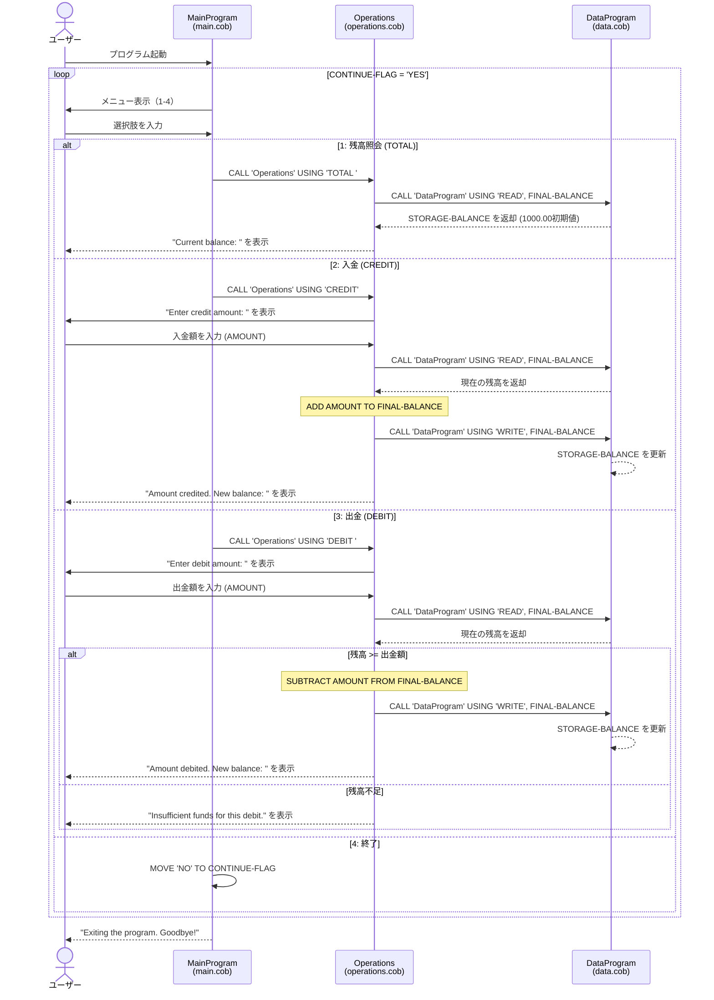

# COBOL 学生アカウント管理システム ドキュメント

## 概要

本システムは COBOL で実装された学生アカウント管理システムです。残高の照会、入金（クレジット）、出金（デビット）の基本的な口座操作を提供します。システムは 3 つの COBOL ソースファイルで構成されています。

---

## ファイル構成

```
src/cobol/
├── main.cob        # メインプログラム（ユーザーインターフェース）
├── operations.cob  # 業務ロジック（口座操作）
└── data.cob        # データ管理（残高の読み書き）
```

---

## 各ファイルの詳細

### 1. `main.cob` — メインプログラム

**プログラム ID:** `MainProgram`

**目的:**
システムのエントリーポイントであり、ユーザーにメニューを表示して操作の選択を受け付けるインターフェース層です。

**主要な機能:**
- テキストベースのメニュー表示（残高照会、入金、出金、終了）
- ユーザー入力（1〜4）の受付と検証
- 選択に応じた `Operations` プログラムの呼び出し
- 無効な入力に対するエラーメッセージ表示
- `CONTINUE-FLAG` によるループ制御（ユーザーが「終了」を選択するまで繰り返し）

**メニューオプション:**

| 選択肢 | 操作 | 呼び出しパラメータ |
|--------|------|---------------------|
| 1 | 残高照会 | `'TOTAL '` |
| 2 | 入金（クレジット） | `'CREDIT'` |
| 3 | 出金（デビット） | `'DEBIT '` |
| 4 | 終了 | — |

---

### 2. `operations.cob` — 業務ロジック

**プログラム ID:** `Operations`

**目的:**
口座に対する具体的な業務操作（残高照会・入金・出金）のロジックを実装します。`MainProgram` から呼び出され、データの読み書きは `DataProgram` に委譲します。

**主要な機能:**

- **残高照会 (`TOTAL`)**
  - `DataProgram` から現在の残高を読み取り、画面に表示する。

- **入金 (`CREDIT`)**
  - ユーザーから入金額を受け付ける。
  - `DataProgram` から現在の残高を読み取る。
  - 入金額を残高に加算する。
  - 更新後の残高を `DataProgram` に書き戻す。

- **出金 (`DEBIT`)**
  - ユーザーから出金額を受け付ける。
  - `DataProgram` から現在の残高を読み取る。
  - 残高が出金額以上か検証する。
  - 十分な残高がある場合のみ出金を実行し、残高を更新する。
  - 残高不足の場合はエラーメッセージを表示する。

**データ型:**
- `AMOUNT`: `PIC 9(6)V99` — 最大 999,999.99 までの金額
- `FINAL-BALANCE`: `PIC 9(6)V99` — 初期値 1,000.00

---

### 3. `data.cob` — データ管理

**プログラム ID:** `DataProgram`

**目的:**
口座残高データの永続的な保持と読み書きを管理するデータアクセス層です。`Operations` プログラムから呼び出されます。

**主要な機能:**
- **読み取り (`READ`)**: `STORAGE-BALANCE` の値を呼び出し元に返す。
- **書き込み (`WRITE`)**: 呼び出し元から受け取った値で `STORAGE-BALANCE` を更新する。

**データ型:**
- `STORAGE-BALANCE`: `PIC 9(6)V99` — 初期値 1,000.00
- `PASSED-OPERATION`: `PIC X(6)` — 操作タイプ（`'READ'` または `'WRITE'`）
- `BALANCE`: `PIC 9(6)V99` — 連携用の残高フィールド

---

## 学生アカウントに関連する業務ルール

| # | ルール | 説明 |
|---|--------|------|
| 1 | **初期残高** | すべてのアカウントは 1,000.00 の初期残高で開始される。 |
| 2 | **残高上限** | 残高は `PIC 9(6)V99` 形式で、最大 999,999.99 まで保持可能。 |
| 3 | **出金制限（残高不足防止）** | 出金額が現在の残高を超える場合、取引は拒否され「Insufficient funds for this debit.」と表示される。残高がマイナスになることはない。 |
| 4 | **入金制限なし** | 入金操作には金額の上限チェックが存在しない。データ型の上限（999,999.99）を超えるとオーバーフローが発生する可能性がある。 |
| 5 | **単一アカウント** | 現在のシステムは単一の口座のみをサポートする。複数アカウントの管理機能はない。 |
| 6 | **インメモリストレージ** | 残高は `WORKING-STORAGE` に保持されるため、プログラム終了時にデータは失われる（永続化されない）。 |
| 7 | **金額精度** | すべての金額は小数点以下 2 桁（セント単位）で処理される。 |

---

## プログラム間の呼び出しフロー

```
MainProgram
  │
  ├──[1: 残高照会]──→ Operations ('TOTAL ')
  │                        └──→ DataProgram ('READ')
  │
  ├──[2: 入金]──────→ Operations ('CREDIT')
  │                        ├──→ DataProgram ('READ')
  │                        └──→ DataProgram ('WRITE')
  │
  ├──[3: 出金]──────→ Operations ('DEBIT ')
  │                        ├──→ DataProgram ('READ')
  │                        ├──→ 残高チェック
  │                        └──→ DataProgram ('WRITE') ※残高十分な場合のみ
  │
  └──[4: 終了]──────→ プログラム終了
```

---

## シーケンス図（データフロー）


